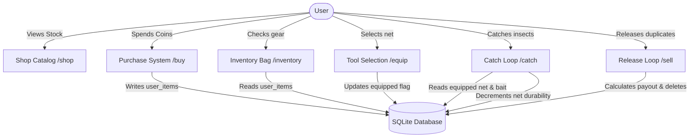

# Fable Bot — Inventory & Shop Integration Architecture

This document maps the architectural flows, database interactions, and sequence diagrams connecting `/shop`, `/buy`, `/inventory`, `/equip`, and `/sell`.

---

## 1. System Integration Map

The inventory system manages two types of items (Nets and Baits) and interfaces with the catch engine to resolve rarity weights:



---

## 2. Command Flows & Database Operations

### A. Shop Catalog (`/shop`)
* **Reads**: Reads static config pack [items.json](file:///data/data/com.termux/files/home/works/fableBot/src/configs/items.json) via `ItemService` in-memory.
* **Writes**: None (Read-only command).
* **Components**: Spawns a select menu component (`StringSelectMenuBuilder`) letting players select and load category tables (`Nets` vs `Baits`).

### B. Purchase System (`/buy [item_id]`)
* **Transaction Flow**:
  1. Checks user coin balance (`getUser` statement).
  2. Deducts item price (`updateUserBalance` statement).
  3. Inserts or updates inventory count (`upsertUserItem` statement).
  4. **Smart Equip Rule**: Checks if the user has an equipped net (`getUserNet` statement). If no net is equipped, auto-equips the newly purchased net (`equipNet` statement).

### C. Inventory Bag (`/inventory`)
* **Reads**: Performs a query to retrieve all items owned by the user (`getUserItems` statement).
* **Formatting**: Filters out zero-count items, groups them by type, highlights the active net at the top of the description, and lists remaining durabilities using tree-branch formatting rules.

### D. Tool Selection (`/equip [net_id]`)
* **Transaction Flow**:
  1. Checks if the item is owned in `user_items` (`getUserItem` statement).
  2. Ensures the target item belongs to the `'net'` category.
  3. Executes `equipNet` prepared statement:
     ```sql
     UPDATE user_items 
     SET equipped = CASE WHEN item_id = ? THEN 1 ELSE 0 END 
     WHERE user_id = ? AND category = 'net'
     ```
     *(This atomically switches the active equipped net to the selection and un-equips all other nets).*

### E. Release Loop (`/sell [target] [count]`)
* **Transaction Flow**:
  1. Loads user collection (`getCollection` statement).
  2. Identifies target insects matching name or tier input.
  3. Deducts insect quantity (`removeInsect` or `decrementInsect` statements).
  4. Applies logarithmic duplicate multiplier bonuses.
  5. Computes total payout and updates user balance (`updateUserBalance` statement).
